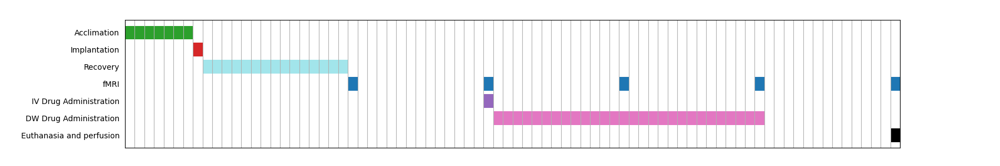
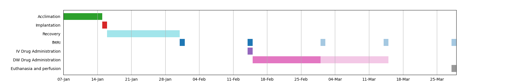

# Simple Gantt Chart Library

Transform `.csv` schedule files into Gantt charts with optional completion shading.

## Output Examples

Plotting result for [day count CSV input](tests/data/count.csv)

Plotting result for [day count CSV input](tests/data/dates.csv)

